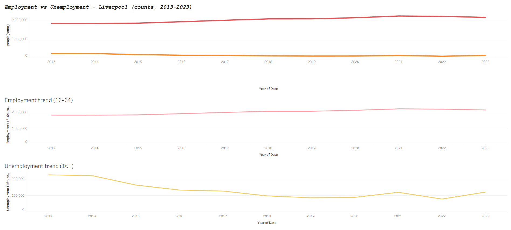

# Liverpool Cost-of-Living Labour Market Tracker

This project analyses how employment and unemployment in Liverpool have changed over time, with a focus on the cost-of-living period. It uses APS / ONS-style labour-market data and produces a cleaned time series plus a Tableau dashboard.

## Data

All data is stored in the `data/` folder:

- `data/data_raw/liverpool data.xlsx` – original Liverpool labour market data
- `data/data_raw/london and nearby data.csv` – comparison region (London & nearby)
- `data/liverpool_clean.csv` / `data/london_clean.csv` – cleaned core tables
- `data/liverpool_labour_core.csv` / `data/liverpool_labour_core_clean.csv` – focused Liverpool labour subset
- `data/liverpool_timeseries_clean.csv` – final time-series used for the dashboard
- `data/liverpool_cost_living.db` – SQLite database version of the cleaned tables

## Tools

- Python (pandas, matplotlib, Jupyter Notebook)
- Tableau Public (for the final dashboard)
- Git & GitHub for version control

## What I did

- Cleaned and reshaped raw APS-style labour data for Liverpool and London into tidy time-series.
- Engineered yearly employment (16–64) and unemployment (16+) metrics for Liverpool.
- Exported the cleaned data into CSV and SQLite for reuse in SQL / BI tools.
- Built a Tableau dashboard comparing:
  - Employment (16–64, count)
  - Unemployment (16+, count)
  over time (2013–2023) to show long-term trends and the impact of the cost-of-living period.

## Key findings (Liverpool)

- Employment (16–64) shows a clear upward trend over the decade, indicating a strengthening labour market.
- Unemployment (16+) falls steeply from the early 2010s and stays relatively low, with a visible bump around the COVID years.
- Despite the cost-of-living crisis after 2021, unemployment only ticks up slightly by 2023 rather than spiking, suggesting a tight labour market.

## Repository structure

- `data/` – raw and cleaned datasets
- `01_liverpool_cost_of_living_analysis.ipynb` – main data preparation and exploration
- `tableau/` – Tableau packaged workbook and exported dashboard image

## Dashboard

The Tableau dashboard is saved in:

- `tableau/liverpool_labour_dashboard.twbx`

Preview:

